# Jenkins CI with PyTest and GitHub as SCM

22.02.2022 • Rustam-Z

## Summary
I have a Jenkins job which checks every minute (by scheduled CRON job) for the latest commit in GitHub, if it finds a new commit, then Jenkins job will be scheduled.
Tests will be run, and test reports will be generated, coverage report could be accessible via HTTP port of the Jenkins server. ("Test Results Analyzer" plugin need to be installed).

TODO: In any push/commit action on GitHub, GitHub WebHook will send a POST request to Jenkins server (http://<IP>/github-webhook/), other process is the same as previous. 

## Project structure
- `src` - source code
- `tests/test_calc_func.py` - contains tests for math functions
- `tests/test_calc_class.py` - contains tests for a basic Calculator class 

Test modules are placed under the `tests` directory. Note that tests is not a Python package and has no "__init__.py" file.

It is also possible to run pytest directly with the "pytest" or "py.test" command, instead of using the longer "python -m pytest" module form. However, the shorter command does not append the current directory path to PYTHONPATH.

## How it works
1. First, I run the tests on local environment, then started building a CI pipeline, that tracks for any change on SCM;
<br>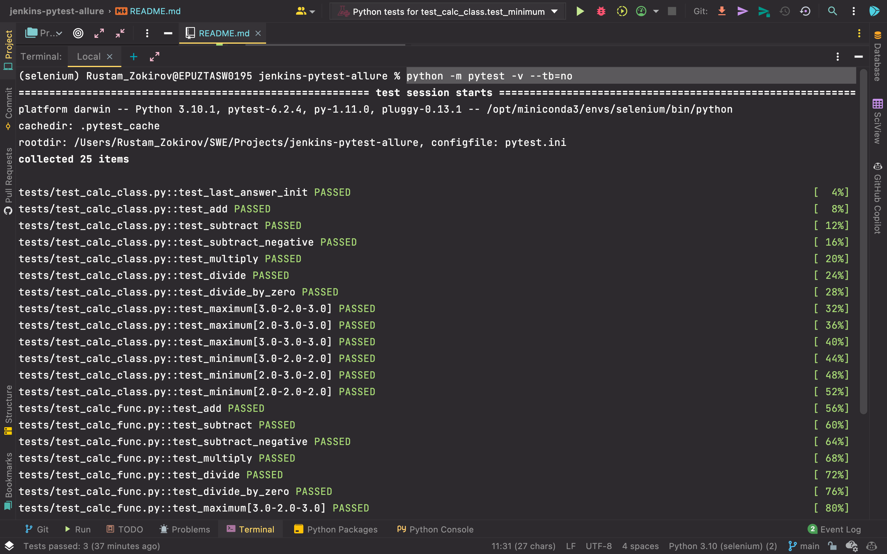

2. I've created an AWS EC2 Ubuntu instance, and installed Jenkins server (installed suggested plugins), Java, Python, and NGINX;
```
# Logging in to AWS EC2 via ssh
ssh -i "my-ssh-key.pem" ubuntu@13.49.145.87 

sudo apt-get update
sudo apt-get install openjdk-8-jre # Install JAVA 8 as Jenkins support only this version
java -sersion

Then follow https://www.jenkins.io/doc/book/installing/linux/#long-term-support-release

sudo service jenkins status # it is running as a server with web ui in port 8080
sudo service jenkins stop # to stop 

# Installing Python and pip
sudo apt-get install python3
python3 --version
sudo apt-get install python3-pip

# Installing NGINX server, we need it to see the result of coverage.py
sudo apt-get install nginx # /var/www/html/index.html is main file
sudo service nginx start
cd /var
sudo chown -R jenkins:root www/
```
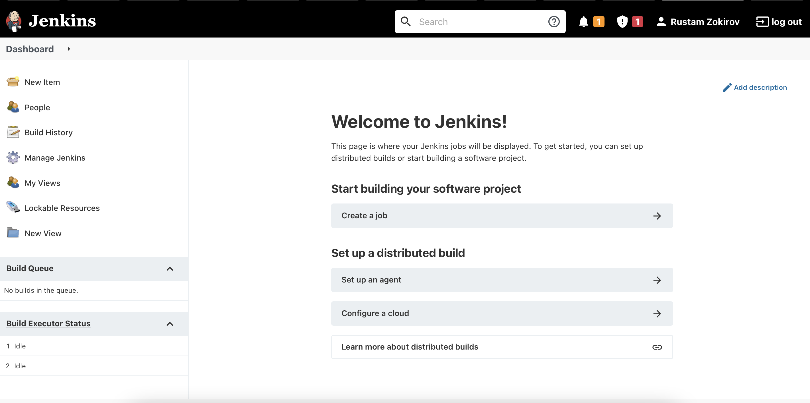

3. Created a freestyle job. Connected a GitHub repository (managed SSH keys using `ssh-keygen`, private key to Jenkins and public to GitHub);
<br>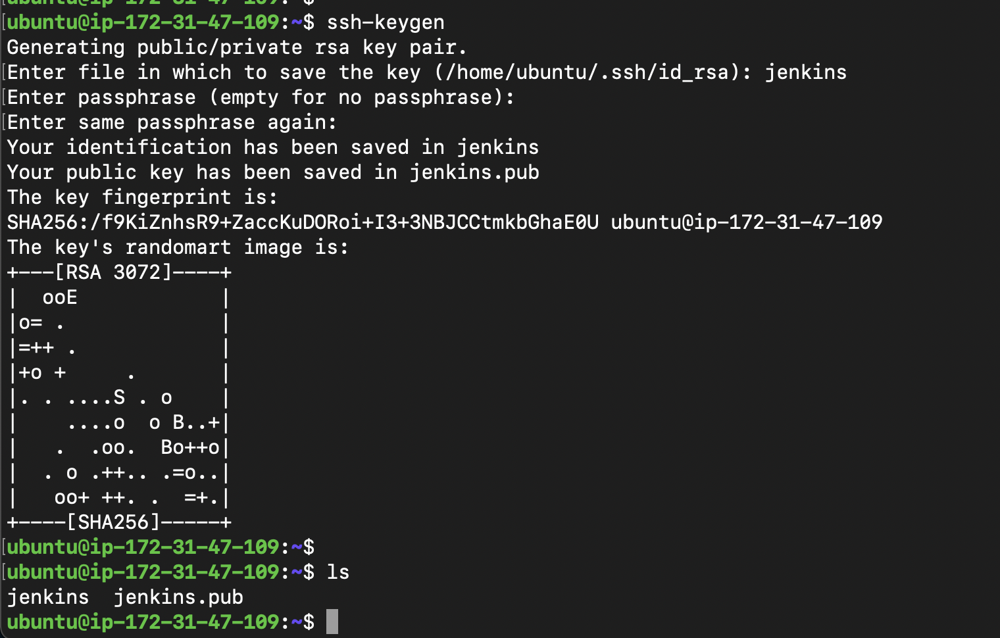
<br>

4.Set build trigger (`* * * * *` means that Jenkins will check GitHub updates every minute);
<br>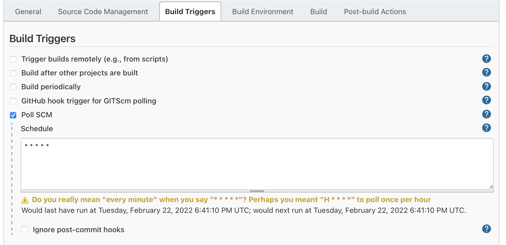

5. Setting up build steps;
<br>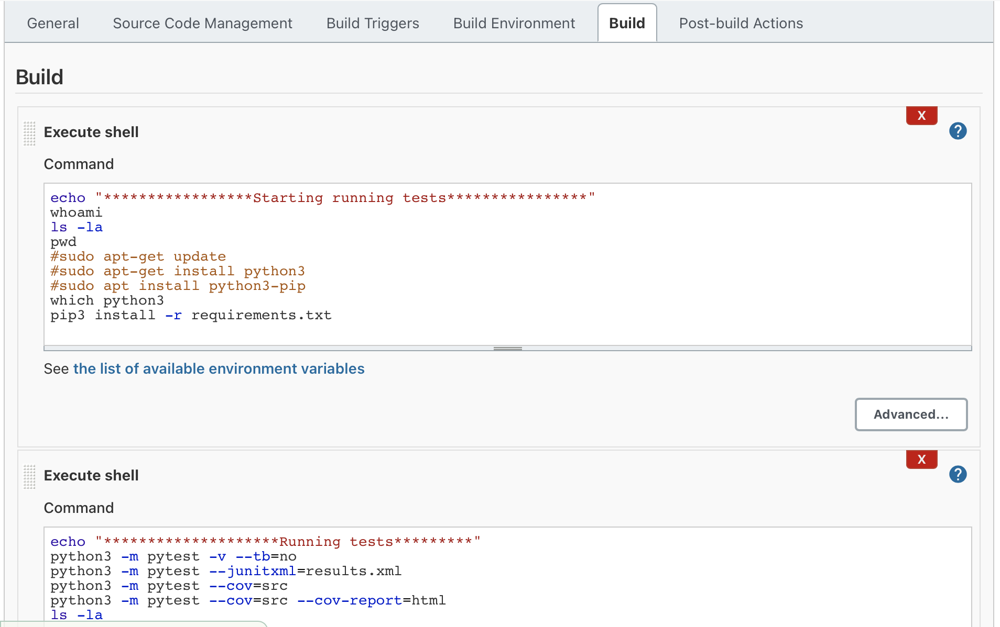
<br>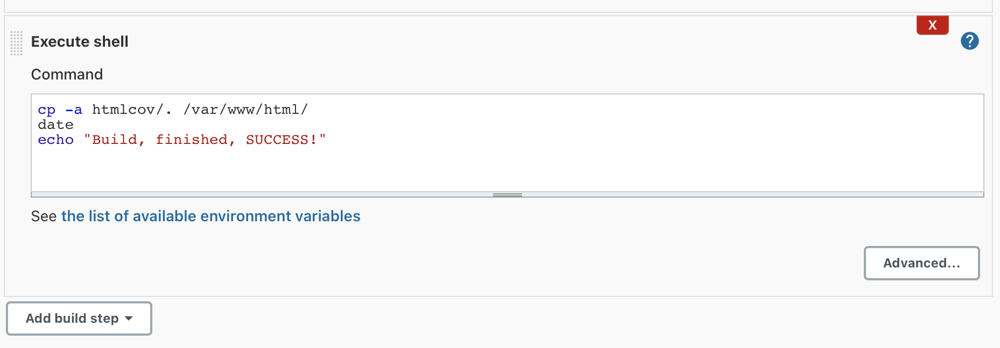
```shell
echo "*****************Starting running tests****************"
whoami
ls -la
pwd
#sudo apt-get update
#sudo apt-get install python3
#sudo apt install python3-pip
which python3
pip3 install -r requirements.txt
echo "********************Running tests*********"
python3 -m pytest -v --tb=no
python3 -m pytest --junitxml=results.xml
python3 -m pytest --cov=src
python3 -m pytest --cov=src --cov-report=html
ls -la
cp -a htmlcov/. /var/www/html/
date
echo "Build, finished, SUCCESS!"
```

7. Post build actions, Apply and Save changes;
<br>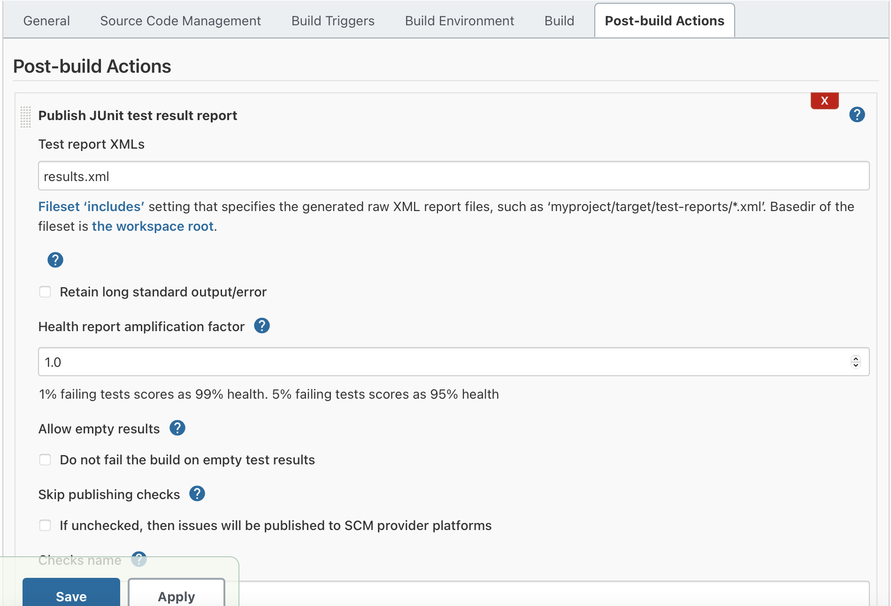

8. Press build now, to run the job, then go inside the job and check build history;
<br>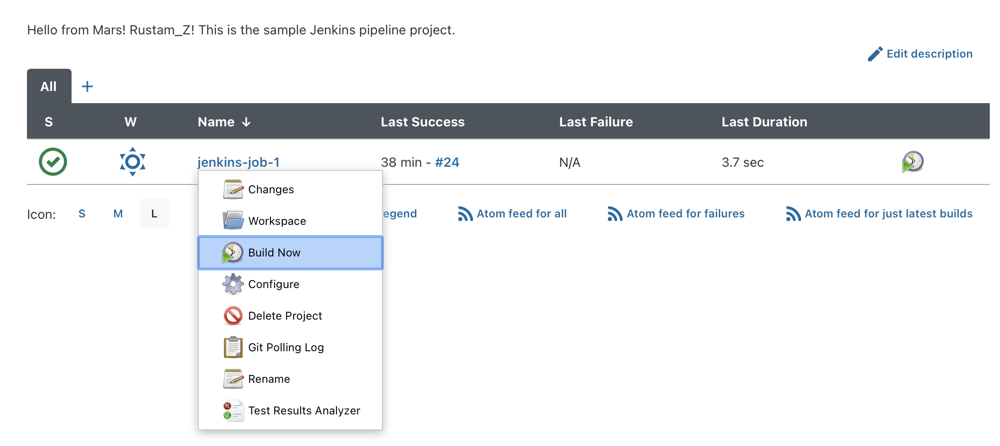
<br>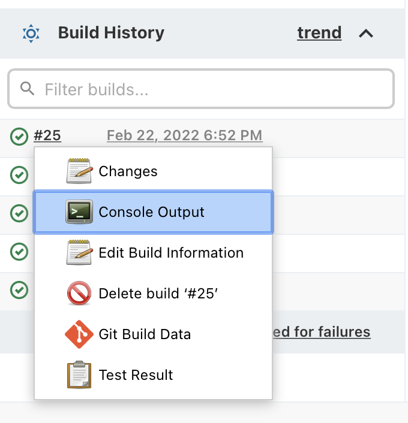

9. This is the logs which are generated for each build;
<br>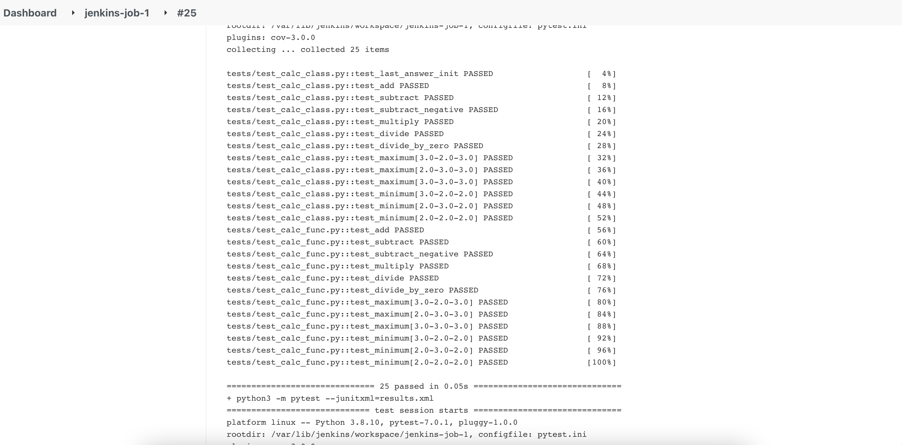

10. Let's check test coverage, we have done it using `cp -a htmlcov/. /var/www/html/`
<br>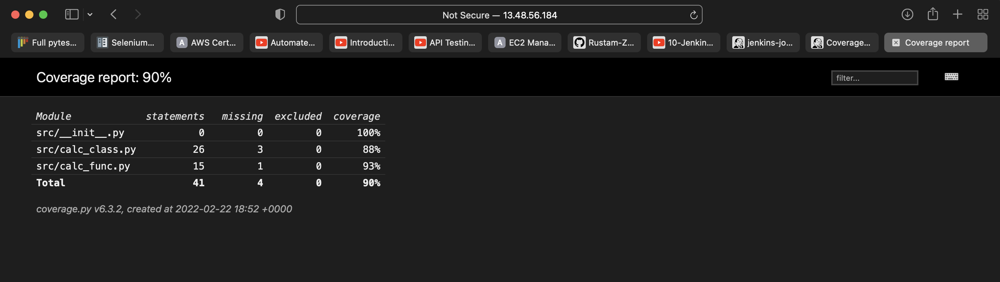

11. Awesome, everything is working now, on each push we run our tests. Let's have a look to test reports generated by "Test Results Analyzer" Jenkins plugin;
<br>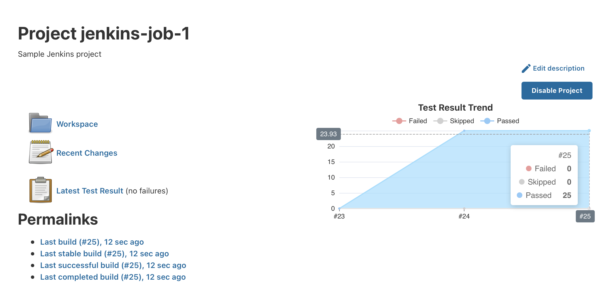

12. Going back to Jenkins, <YOUR JOB>, you can click on "Test Results Analyzer" to see a view that lists which tests haven’t been run for different sessions, along with the pass/fail status 
<br>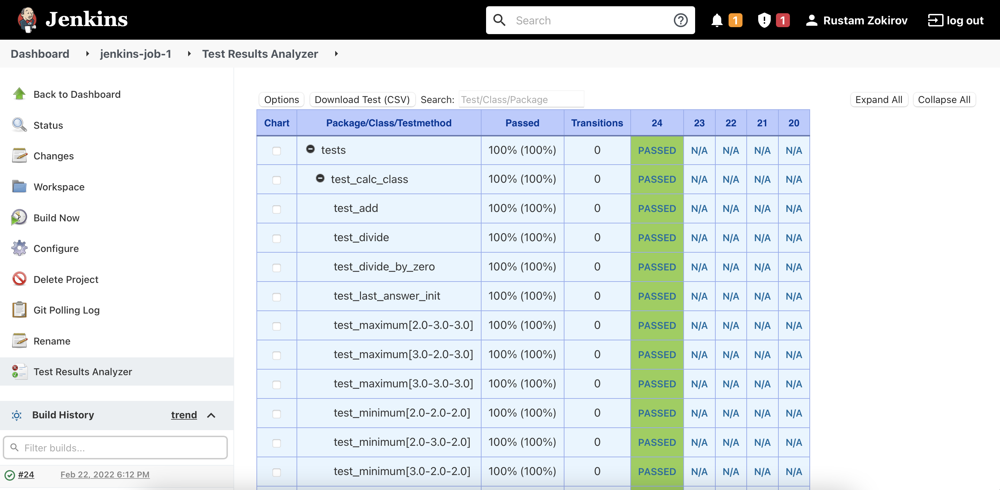

13. Checking one more time, that everything works when I push;
<br>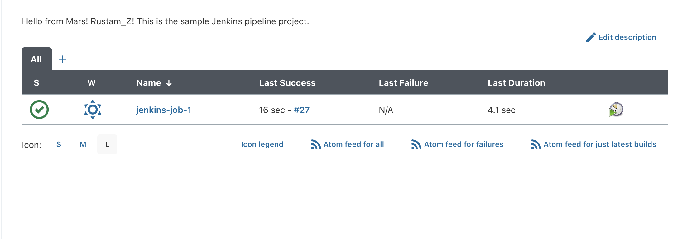


## How to run?
- `pip install -r requirements.txt`
- `python -m pytest -v --tb=no`
- `python -m pytest --junitxml=results.xml`
- `python -m pytest --cov=src` to see the coverage
- `python -m pytest --cov=src --cov-report=html` check htmlcov/index.html 

